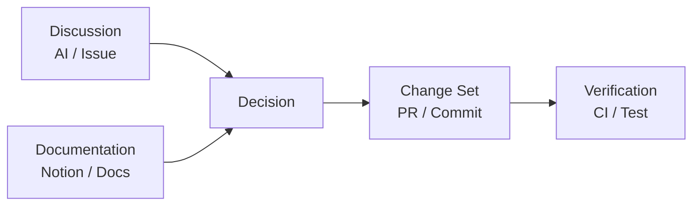
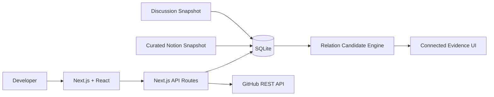

# CHANGELOG

> **Personal Evidence AI for Developers**  
> 흩어진 개발 기록을 연결해, **무엇을 했는가뿐 아니라 왜 그렇게 했는가까지 원본 Evidence와 함께 복원하는 개발자 작업 기억 시스템**입니다.


> 이 저장소는 **공개 Showcase / Case Study**입니다. 실제 개발 코드와 개인 작업 원본 데이터는 비공개 저장소에서 관리하며, 여기에는 제품 개념·검증 과정·설계 학습·비식별화된 예시만 정리합니다.

---

## 왜 CHANGELOG인가

개발 과정의 중요한 기록은 한곳에 남지 않습니다.

- AI와의 설계 논의는 ChatGPT·Claude 같은 대화 도구에 남고
- 요구사항과 의사결정은 Notion 같은 문서 도구에 남고
- 실제 구현은 GitHub Commit·PR·Issue에 남고
- 검증은 CI/CD와 테스트 결과에 남습니다.

문제는 **기록이 없는 것이 아니라 서로 연결되어 있지 않다는 것**입니다.

시간이 지나 프로젝트를 다시 열면 `무엇을 했는가`는 GitHub에서 찾을 수 있어도 다음 질문은 훨씬 어렵습니다.

> 왜 이 구조를 선택했지?  
> 어떤 대안을 검토했지?  
> 그 결정은 실제로 무엇으로 구현됐지?  
> 구현이 검증됐다는 근거는 어디 있지?

CHANGELOG는 이 흐름을 하나의 Evidence Chain으로 연결합니다.

```text
Discussion
    ↓
Decision
    ↓
Documentation
    ↓
Implementation
    ↓
Verification
```

---

## 현재 핵심 경험 — Connected Evidence Alpha

현재 Alpha는 **Decision을 중심으로 관련 Evidence를 압축해서 보여주는 경험**을 검증하고 있습니다.



한 Decision을 선택하면 다음을 확인할 수 있습니다.

- **Discussion** — 이 결정이 나오게 된 실제 논의
- **Documentation** — 설계·정책·Decision Log
- **Implementation** — 관련 Change Set / PR / Commit
- **Verification** — 성공한 CI / 테스트
- **Original Source** — 각 Evidence의 원본으로 이동
- **Relation Candidate** — 아직 연결되지 않은 기록 중 관련 가능성이 높은 후보

> Graph 자체가 목적이 아니라, **과거 판단 맥락을 빠르게 복원하기 위한 탐색 View**로 사용합니다.

---

## 실제 프로토타입 진화

CHANGELOG는 처음부터 현재 구조를 가정하지 않았습니다. 실제 데이터를 넣고 사용하면서 제품 가설을 단계적으로 수정했습니다.

```text
Visual Alpha
    ↓
화면만 재현해서는 제품 가치를 검증하기 어려움
    ↓
Functional Alpha
    ↓
Timeline / Decision / Evidence / SQLite interaction 구현
    ↓
Real-data Alpha
    ↓
샘플 데이터로는 Context Recovery 가치를 판단하기 어려움
    ↓
실제 Notion Snapshot + GitHub API Sync
    ↓
Data Aggregation Alpha
    ↓
기록은 많이 들어왔지만 서로 연결되지 않음
    ↓
Connected Evidence Alpha
    ↓
Discussion → Decision → Documentation → Implementation → Verification
    ↓
현재
Semantic Evidence + Change Set + Relation Candidate + Human Confirmation
```

자세한 과정은 [Connected Evidence Alpha](docs/connected-evidence-alpha.md)에 정리했습니다.

---

## From Activity Feed to Connected Evidence

단순 수집만 하면 다음처럼 됩니다.

```text
148 raw records

commit
commit
PR
CI
CI
CI
Notion
AI conversation
...
```

CHANGELOG가 목표로 하는 것은 이 기록을 **사람이 기억하는 판단 단위**로 다시 조직하는 것입니다.

```text
Decision
"Context Graph를 1차 제품에 포함"

├─ Discussion       1 Evidence
├─ Documentation    3 Evidence
├─ Implementation   1 Change Set / 2 Evidence
└─ Verification     1 latest success / 2 Evidence
```

원본 기록은 보존하지만, 기본 화면에서는 **대표 Evidence와 의미 있는 Change Set만 먼저 노출**합니다.

---

## 실제 데이터 적용에서 나온 설계 학습

### 1. Source ≠ Evidence Role

초기에는 `GitHub Commit = Implementation`처럼 Source와 역할을 단순하게 매핑했습니다.

실제 데이터를 넣자 같은 GitHub 안에서도 의미가 달랐습니다.

```text
GitHub docs: commit  → Documentation
GitHub code commit   → Implementation
GitHub Issue         → Discussion / Collaboration
GitHub Actions       → Verification
```

따라서 현재 모델에서는 **Source와 Semantic Role을 분리**합니다.

### 2. PR ≠ Change Set

GitHub의 하나의 PR 안에서도 여러 의미 있는 제품 변화가 발생할 수 있습니다.

```text
PR #4
├─ Functional Alpha
├─ Real-data Alpha
├─ Connected Evidence Alpha
└─ Candidate Engine
```

따라서 `PR = GitHub container`, `Change Set = 사람이 기억하는 의미 단위`라는 가설을 검증하고 있습니다.

### 3. 자동화보다 신뢰

Relation을 많이 만드는 것보다 **왜 이 기록이 이 Decision에 연결됐는지 믿을 수 있는 것**이 중요합니다.

현재 Alpha의 규칙 기반 Candidate는 다음처럼 보수적으로 동작합니다.

| 관련도 | 처리 |
| --- | --- |
| 75+ | 높은 신뢰 후보만 제한적으로 자동 연결 |
| 50~74 | 사용자 검토 권장 |
| 35~49 | 낮은 관련도, 기본 접힘 |
| <35 | 기본적으로 숨김 |

후보 점수는 확률이 아니라 **규칙 기반 관련도**입니다.

더 자세한 내용은 [설계 결정과 학습](docs/decisions-and-learnings.md)을 참고하세요.

---

## 현재 구현 범위

| 영역 | 상태 |
| --- | --- |
| Next.js Prototype UI | ✅ 구현 |
| SQLite Persistence | ✅ 구현 |
| GitHub API Sync | ✅ 구현 |
| Commit / PR / Issue / Actions ingestion | ✅ 구현 |
| 실제 Notion Snapshot | ✅ Prototype 방식 |
| Decision / Evidence Relation | ✅ 구현 |
| Connected Evidence Graph | ✅ Alpha |
| Original Source traceability | ✅ Alpha |
| Semantic Evidence classification | 🧪 규칙 기반 Alpha |
| Change Set | 🧪 검증 중 |
| Relation Candidate scoring | 🧪 규칙 기반 Alpha |
| Human confirmation / ignore | ✅ Alpha |
| Non-destructive prototype migration | ✅ Alpha |
| 실시간 Notion Connector | ⏳ 계획 |
| AI Decision extraction | ⏳ 계획 |
| Embedding / Vector Search / RAG | ⏳ 계획 |
| Supabase 정식 데이터 모델 | ⏳ Final ERD 이후 |
| Multi-user Auth / RLS | ⏳ 정식 제품 단계 |

현재 구현과 장기 아키텍처를 혼동하지 않도록 **Prototype과 Planned Architecture를 분리**해서 관리합니다.

---

## 현재 Prototype Architecture



정식 제품에서는 Source Adapter, Supabase PostgreSQL, AI/RAG 계층 등으로 확장할 계획입니다.

자세한 내용은 [아키텍처](docs/architecture.md)를 참고하세요.

---

## Evidence Model

현재 Alpha의 핵심 모델은 다음 흐름을 검증합니다.

```text
Activity
  ↓
Evidence
  ↓
Decision
  ↓
Relation
  ↓
Change Set / Verification
```

그리고 Evidence는 Source와 역할을 분리합니다.

```text
Source
- GitHub
- Notion
- AI Conversation

Semantic Role
- Discussion
- Documentation
- Implementation
- Verification
```

자세한 내용은 [Evidence Model](docs/evidence-model.md)을 참고하세요.

---

## Privacy by Default

CHANGELOG는 개인 코드, AI 대화, 협업 기록을 다룰 수 있기 때문에 Privacy를 부가 기능이 아니라 **제품의 기본 전제조건**으로 봅니다.

- 가능한 경우 Read-only 접근 우선
- Repository / Project 단위 선택적 Import
- secret / token / credential 기본 제외
- 원본 Source와 파생 Evidence의 provenance 추적
- AI가 원본을 덮어쓰지 않음
- 중요한 Decision과 Relation은 사용자가 최종 확인 가능
- 공개 Showcase에는 실제 개인 대화 원문·민감 Notion 내용·Private repository data를 포함하지 않음

---

## Roadmap

```text
P0  Connected Context
    Source → Activity → Timeline → Decision → Evidence → Context Graph

P1  Evidence Intelligence
    Semantic Classification → Relation Candidate → Change Set → Human Confirmation

P2  Personal Evidence AI
    Ask CHANGELOG → Evidence Retrieval → RAG → Long-term Context Recovery

P3  Evidence Reuse
    Project Story → Retrospective → Portfolio / Resume / Interview / Handoff
```

자세한 계획은 [Roadmap](docs/roadmap.md)에 정리했습니다.

---

## 공개 저장소의 범위

이 저장소에는 다음을 포함합니다.

- 제품 문제 정의와 핵심 가설
- Connected Evidence Alpha까지의 프로토타입 진화
- 공개 가능한 아키텍처와 Evidence 모델
- 실제 검증 과정에서 발견한 설계 학습
- 현재 구현 / 미구현 상태
- 로드맵

다음은 포함하지 않습니다.

- 비공개 실제 제품 코드 전체
- 개인 Notion 원문
- ChatGPT / Claude 대화 원문
- Private repository의 민감 코드와 원본 데이터
- GitHub token / credential / `.env`
- SQLite 실제 사용자 DB

---

## 문서

- [Connected Evidence Alpha](docs/connected-evidence-alpha.md)
- [Evidence Model](docs/evidence-model.md)
- [Architecture](docs/architecture.md)
- [Decisions & Learnings](docs/decisions-and-learnings.md)
- [Roadmap](docs/roadmap.md)

---

## 현재 상태

**Connected Evidence Alpha**

실제 개발 기록을 넣었을 때 단순 Aggregation만으로는 과거 판단 맥락이 복원되지 않는다는 점을 확인했고, 현재는 **Decision을 중심으로 Discussion · Documentation · Implementation · Verification을 신뢰 가능한 Relation으로 연결하는 경험**을 검증하고 있습니다.

다음 검증의 초점은 다음과 같습니다.

1. 많은 raw record를 의미 있는 Change Set으로 얼마나 잘 압축할 수 있는가
2. Relation Candidate가 오탐을 줄이면서 실제 관련 기록을 충분히 찾는가
3. 연결된 Evidence Chain만 보고 과거의 판단 맥락을 빠르게 복원할 수 있는가
4. 이 사용 경험이 Final ERD와 정식 AI/RAG 구조에 어떤 필드를 요구하는가

---

## License

현재 Showcase는 프로젝트 소개 및 포트폴리오 목적의 공개 저장소입니다. 별도 오픈소스 라이선스는 아직 지정하지 않았습니다.
