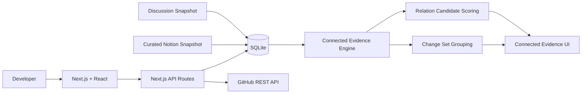
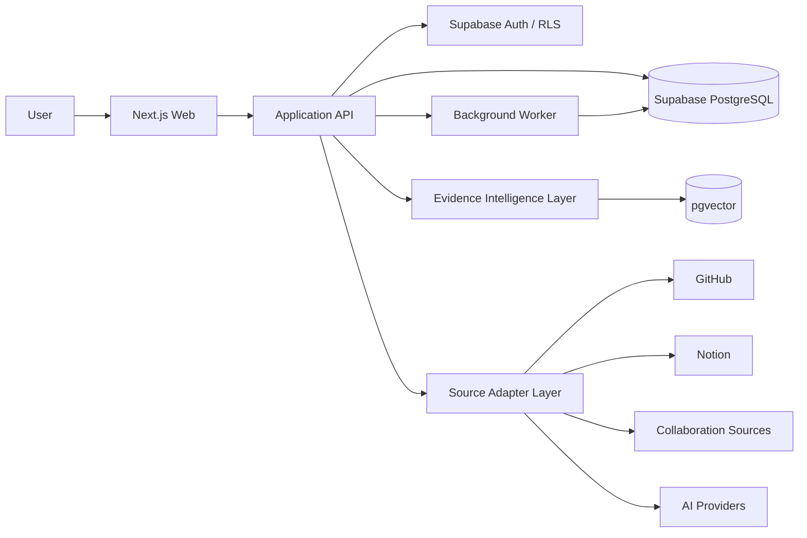

# Architecture

## 현재 Prototype Architecture

Connected Evidence Alpha는 정식 인프라를 먼저 확정하지 않고 제품 interaction과 Evidence model을 검증하기 위해 **Next.js + SQLite**로 구성합니다.



### 현재 책임

**React / Next.js UI**
- Decision 목록
- Connected Evidence Graph
- Evidence Detail
- Candidate review
- Source filter / search

**Next.js server/API**
- SQLite 읽기/쓰기
- GitHub API Sync
- Evidence 생성
- Change Set grouping
- Relation scoring

**SQLite**
- Prototype persistence
- Activity / Decision / Evidence / Relation
- Change Set
- Candidate review

**GitHub REST API**
- Commit
- Pull Request
- Issue
- Actions Workflow Run

**Notion / Discussion Snapshot**
- Alpha에서 실시간 Connector를 구현하기 전 실제 제품 맥락을 검증하기 위한 snapshot ingestion

---

## 왜 SQLite로 시작했는가

정식 ERD를 먼저 고정하면 실제 사용에서 발견되는 Relation과 provenance 요구를 놓칠 수 있다고 판단했습니다.

```text
실제 기록
→ SQLite Prototype
→ 직접 사용
→ 관계/필드/UX 수정
→ Final ERD
→ Supabase PostgreSQL
```

현재까지 실제 사용에서 이미 다음 모델 변경이 발생했습니다.

- Source와 Evidence Role 분리
- Change Set 개념 추가
- Candidate review 상태 추가
- Non-destructive migration 필요성 확인

이는 Prototype-first 전략의 직접적인 결과입니다.

---

## Planned Architecture

정식 제품 단계에서는 다음 구조를 기준으로 확장할 계획입니다.



정식 기술 선택은 Alpha 검증 결과에 따라 조정할 수 있습니다.

---

## Source Adapter 원칙

제품 모델이 특정 서비스 이름에 종속되지 않도록 Source Family와 Provider를 분리합니다.

```text
Documentation
└─ Notion / future providers

Collaboration
└─ Discord / Slack / Issues

Implementation
└─ GitHub / Git providers

AI Work
└─ ChatGPT / Claude / future AI providers
```

Provider Adapter가 원본 레코드를 공통 Activity/Evidence 형태로 변환하고 provenance를 유지하는 구조를 지향합니다.

---

## Graph Storage

현재 Alpha에서 Graph는 별도 Graph DB를 사용하지 않습니다.

```text
Decision
Evidence
Relation
Change Set
```

을 SQLite 관계형 모델로 저장합니다.

정식 제품에서도 우선 PostgreSQL Relation 모델을 사용할 가능성이 높으며, Global Graph 탐색 요구가 충분히 커졌을 때 별도의 Graph DB 도입을 검토합니다.

Graph DB 사용 자체가 제품 목적은 아닙니다.

---

## Privacy Architecture Principles

Source integration은 다음 원칙을 기본 제약으로 둡니다.

- Read-only 권한 우선
- 필요한 repository / project만 선택
- secret / token / credential 수집 제외
- Original Source URL 보존
- 파생 Evidence와 원본 provenance 연결
- 연결 해제 및 삭제 경로
- 사용자별 데이터 경계

정식 멀티 사용자 단계에서는 Auth와 RLS를 포함해 이 경계를 DB 수준에서도 강제할 계획입니다.
