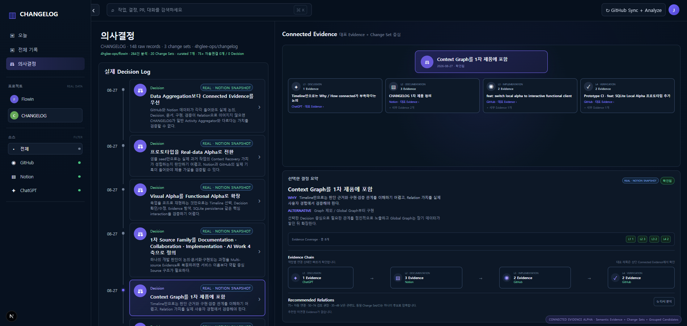

# Connected Evidence Alpha

## 현재 화면



현재 Local Alpha는 **Decision Log에서 하나의 결정을 선택하고, 그 판단을 설명하는 Discussion · Documentation · Implementation · Verification을 대표 Evidence 중심으로 확인하는 흐름**을 검증합니다.

현재 화면에서 선택한 예시는 `Context Graph를 1차 제품에 포함` Decision입니다.

```text
Decision
"Context Graph를 1차 제품에 포함"

├─ Discussion       1 Evidence
├─ Documentation    3 Evidence
├─ Implementation   2 Evidence
└─ Verification     2 Evidence
```

이 숫자는 제품 성과 지표가 아니라 **실제 Local Alpha 데이터에서 해당 Decision에 연결된 Evidence Coverage 예시**입니다.

---

## 목표

Connected Evidence Alpha의 목표는 **많은 개발 기록을 수집하는 것 자체가 아니라, 과거의 중요한 판단을 다시 이해할 수 있도록 기록 사이의 관계를 연결하는 것**입니다.

초기 프로토타입에서는 Activity를 Timeline에 모으는 것만으로도 가치가 있을 것이라 가정했습니다. 실제 GitHub와 Notion 데이터를 넣어보자 다른 문제가 드러났습니다.

```text
Data Aggregation
→ 기록은 많아짐
→ 하지만 왜 이 기록이 중요한지 알기 어려움
→ Decision과 Evidence가 서로 연결되지 않음
```

그래서 현재 Alpha의 핵심 가설은 다음으로 바뀌었습니다.

> 개발자는 모든 기록을 다시 보고 싶은 것이 아니라, 중요한 Decision 주변의 Discussion · Documentation · Implementation · Verification을 빠르게 복원하고 싶다.

---

## 프로토타입 진화

### 1. Visual Alpha

제품 목업을 코드 화면으로 옮기는 단계였습니다.

검증 결과:

- 화면 구조는 확인할 수 있었음
- 실제 선택/수정/저장 경험은 검증할 수 없었음

### 2. Functional Alpha

SQLite persistence와 기본 interaction을 추가했습니다.

검증한 항목:

- Timeline 선택
- Decision 선택
- Evidence Detail
- Decision 수정/상태 변경
- Relation 연결
- SQLite write persistence

### 3. Real-data Alpha

샘플 데이터만으로는 실제 Context Recovery 가치를 판단하기 어렵다고 보고 실제 기록을 넣었습니다.

```text
GitHub
→ REST API Sync
→ Commit / PR / Issue / Actions

Notion
→ 필요한 문서를 선별
→ Snapshot 형태로 SQLite에 저장

Discussion
→ 실제 프로젝트 논의를 기반으로 curated snapshot
```

### 4. Data Aggregation Alpha

실제 기록 수집에는 성공했지만 GitHub raw records가 빠르게 증가했습니다.

예:

```text
100+ commits / PRs / workflow runs
```

하지만 실제 Decision에 연결된 Evidence는 일부뿐이었습니다.

이 단계에서 다음을 확인했습니다.

> 데이터 수집량과 Context Recovery 품질은 같은 문제가 아니다.

### 5. Connected Evidence Alpha

현재 단계입니다.

```text
Discussion
    ↓ informed_by
Decision
    ↓ documented_by
Documentation
    ↓ implemented_by
Change Set / Implementation
    ↓ verified_by
Verification
```

---

## 핵심 Interaction

### Decision 중심 탐색

사용자는 전체 Graph에서 시작하지 않습니다.

1. Decision을 선택합니다.
2. Decision에 연결된 Evidence 역할별 대표 기록을 봅니다.
3. Evidence Coverage와 Chain을 통해 빠진 단계가 있는지 확인합니다.
4. 필요한 경우 원본 Source를 확인합니다.
5. 연결이 부족하면 Relation Candidate를 검토합니다.

### 대표 Evidence

raw record가 많아져도 Graph에 모두 노출하지 않습니다.

```text
Discussion       → 대표 Evidence 1개
Documentation    → 대표 Evidence 1개
Implementation   → 대표 Change Set / 구현 Evidence
Verification     → 대표 검증 Evidence
```

세부 기록은 필요할 때만 확장합니다.

### Evidence Chain

현재 화면의 하단 Chain은 긴 원본 제목을 다시 나열하지 않고 다음 정보만 압축해서 보여줍니다.

```text
Discussion      Documentation      Implementation      Verification
1 Evidence  →   3 Evidence     →   2 Evidence      →   2 Evidence
ChatGPT          Notion             GitHub              GitHub
```

상단 Connected Evidence 영역에서 대표 Evidence 제목을 보여주기 때문에, Chain은 **역할·개수·Source를 빠르게 스캔하는 보조 View**로 사용합니다.

---

## Relation Candidate

아직 연결되지 않은 GitHub Evidence를 Decision의 후보로 추천합니다.

현재는 AI 모델이 아닌 **규칙 기반 baseline**입니다.

주요 신호:

- Decision 제목/요약과 Evidence 제목의 키워드 일치
- 기술 용어 일치
- Change Set 관계
- PR / Commit / CI 역할
- Decision 발생 시점과 기록 시점의 거리

날짜는 같은 날 많은 작업이 발생할 수 있어 약한 신호로만 사용합니다.

### 신뢰 구간

| 관련도 | 처리 |
| --- | --- |
| 75+ | 제한적 자동 연결 |
| 50~74 | 검토 권장 |
| 35~49 | 낮은 관련도, 접힘 |
| <35 | 기본 숨김 |

이 숫자는 확률이 아닙니다.

---

## Candidate 압축

실제 GitHub Actions를 넣자 같은 Workflow 제목이 여러 번 반복되는 문제가 발생했습니다.

```text
Prototype CI
Prototype CI
Prototype CI
Prototype CI
...
```

DB에서는 서로 다른 Workflow Run이지만, 사용자가 판단할 때는 같은 맥락입니다.

그래서 Candidate는 다음 단위로 압축합니다.

```text
Raw Evidence 30개
↓
Candidate Group 6개
```

동일 CI / 동일 Change Set / 동일 의미의 반복 Commit을 하나의 후보 묶음으로 표현하고 대표 Evidence만 연결합니다.

현재 화면에서는 Candidate가 없거나 이미 충분한 Evidence가 연결된 경우 Recommended Relations 영역을 비워두어, **추천을 억지로 생성하지 않는 것**도 함께 검증하고 있습니다.

---

## Change Set

PR은 좋은 GitHub container지만 반드시 하나의 의미 단위는 아닙니다.

하나의 긴 PR 안에서 여러 제품 변화가 일어날 수 있기 때문입니다.

```text
PR
├─ Functional Alpha
├─ Real-data Alpha
├─ Connected Evidence Alpha
└─ Relation Candidate Engine
```

따라서 현재는 다음 개념을 검증하고 있습니다.

```text
PR = GitHub container
Change Set = 사람이 기억하는 의미 있는 변화 단위
```

현재 Alpha의 Change Set은 PR 기반 grouping에서 시작했으며, 향후 Commit 내용·파일 변경·Decision 관계를 함께 사용해 의미 단위로 확장할 계획입니다.

---

## 화면에서 확인할 수 있는 것

현재 대표 화면은 다음 제품 가설을 한 번에 보여줍니다.

- Decision Log가 별도 중심 객체로 존재한다.
- 하나의 Decision에서 L1~L4 Evidence Coverage를 확인할 수 있다.
- Source 이름보다 Evidence 역할을 먼저 이해할 수 있다.
- Graph에는 모든 raw record가 아니라 대표 Evidence를 우선 노출한다.
- Evidence Chain은 복잡한 Graph를 다시 그리지 않고 연결 상태를 요약한다.
- Relation Candidate는 필요한 경우에만 검토 대상으로 등장한다.

즉 이 화면은 완성 제품을 보여주는 것이 아니라 **Connected Evidence라는 핵심 가설이 실제 UI와 데이터에서 성립하는지 검증하는 현재 Alpha 상태**를 보여줍니다.

---

## Alpha 완료를 판단하는 질문

Connected Evidence Alpha가 성공하려면 단순히 기능이 동작하는 것보다 다음 질문에 답할 수 있어야 합니다.

1. 100개 이상의 raw record 중 중요한 Evidence 몇 개만 보고도 과거 판단이 기억나는가?
2. GitHub·Notion·AI 대화를 따로 검색하는 것보다 Context Recovery가 빨라지는가?
3. 잘못된 Relation을 사용자가 이해하고 수정할 수 있는가?
4. Evidence가 없는 단계의 빈칸이 의미 있는 신호가 되는가?
5. 자동화가 늘어나도 Original Source와 provenance를 신뢰할 수 있는가?

이 질문을 실제 사용으로 검증한 뒤 Final ERD와 AI/RAG 계층을 확정할 계획입니다.
